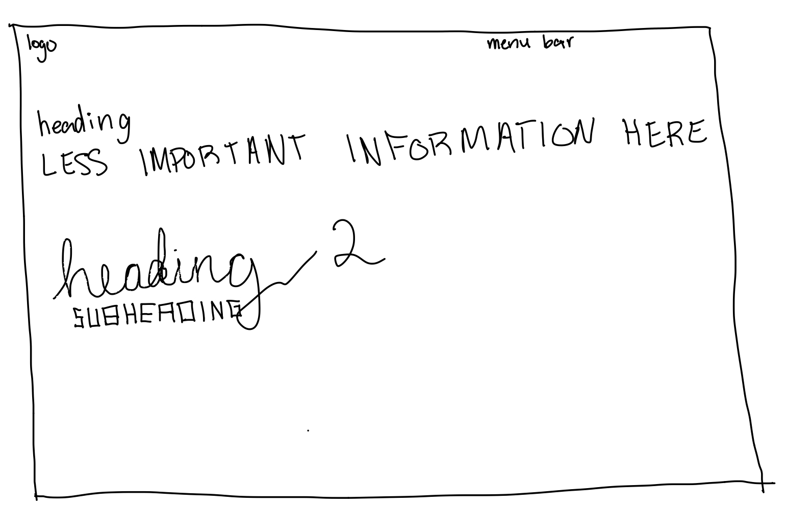

# Design Systems Blog Post

Through reading several articles from designsystems.com, I learned about many different design strategies. One that really stuck out to me was an article about typography. This article discussed various ways to display text and what to consider when choosing how to do so. The article suggests keeping your list of font variations short. This really stuck out to me because I had never considered it to be an issue. But when I thought about it, it made a lot of sense that you should only include a few font types in your interface. I thought about other interfaces I've interacted with, and they follow this rule very well.

I decided to create an interface that did not follow these rules.

This interface consists of multiple font types and sizes. Each text box has a different font type, and the hierarchy is not logical. The less critical information is larger than the heading and utilizes all capitalized letters. This is a very poor interface design because the more important information should stick out.

Articles: \
https://www.designsystems.com/how-a-small-team-built-figma-dot-coms-design-system/ \
https://www.designsystems.com/space-grids-and-layouts/ \
https://www.designsystems.com/typography-guides/ \
https://www.designsystems.com/guide-to-content-strategy-in-design-systems/