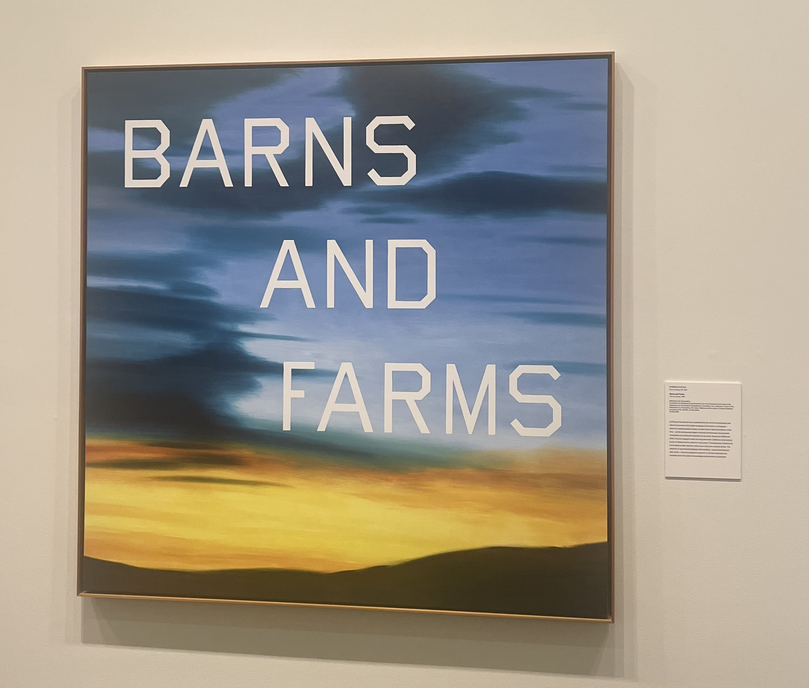
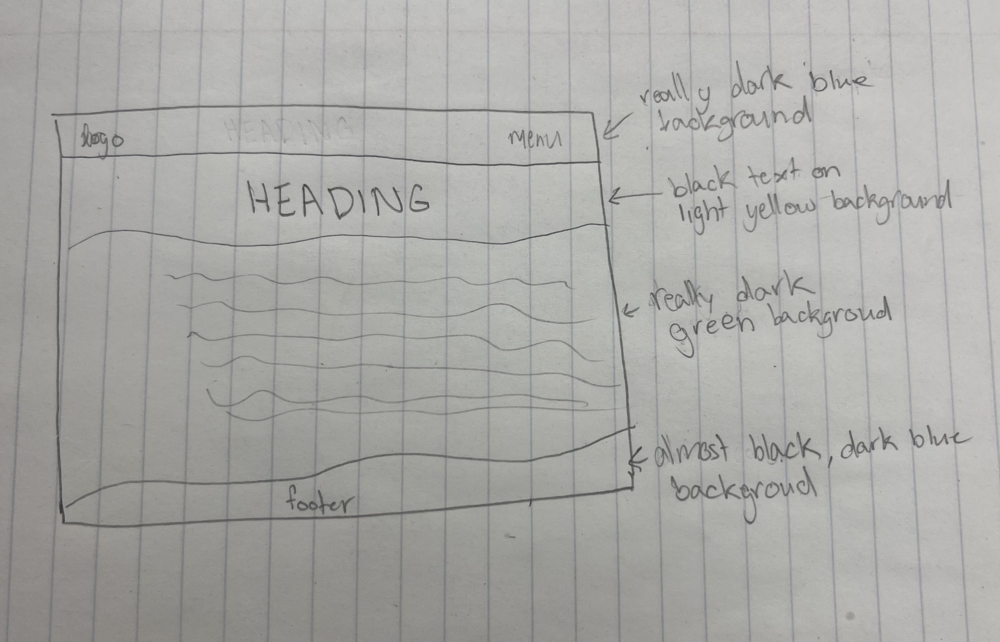

# Finding Inspiration Blog Post
For this blog, I visited the Sheldon Museum of Art in Lincoln, Nebraska. After viewing many different pieces of art, I was struck with inspiration when I saw the Barns and Farms piece.

Barns and Farms is an oil painting on canvas created in 1983. Richard Diebenkorn created the background of this piece, while Ed Ruscha added the text onto the top. The color blocks in the background represent the ocean and sand from the Los Angeles neighborhood where Diebenkorn grew up. Ruscha added the large, capital block letters to depict the agricultural structures he saw when driving from Oklahoma to California.

Color: \
Most of the colors’ values are darker, which is nice because it makes the lighter values stand out. These lighter values do a great job of making the painting look more realistic and like there is real light reflecting off of it. I also really like the color choices of blue and orange/yellow because they complement each other very well. Proven because they are true complimentary colors.\
https://www.getty.edu/education/teachers/building_lessons/formal_analysis.html 

Textual: \
Barns and Farms provides text that serves a clear purpose. The three words chosen, barns and farms, to be included are simple but do a great job of conveying the message about agriculture. I like that they are about agricultural structures while also rhyming. The harsh block letters are a great stylistic choice because they stand out while being blocky, like agricultural buildings (barns and farms). \
https://jerwoodvisualarts.org/art-theory-glossary/textual-analysis-in-art/ 

Visual Balance: \
My eye is immediately drawn to the word barn because that is the largest color contrast of white on dark blue. After that, my eyes are drawn to the yellow/orange color because it is brighter and sticks out since the majority of the piece is dark. I think this does a great job of pointing out the two most important parts of the piece that help convey the meaning. \
https://www.johnlovett.com/balance 

This is the UI I decided to sketch based on the Barns and Farms art piece. This UI has mostly dark backgrounds except for where the heading is. I made the heading lighter to draw the eyes' attention to that spot as the painting did. I also created it so that the most contrast was the bold black text on the light yellow background because that also draws the viewer's attention to that spot. I added wobbly lines separating the heading and footer from the body to reflect the natural curvature of a landscape. The purpose of this interface is to provide information about a landscaping company, so making it look like a landscape, helps convey that purpose. These design choices were all based on the aspects I noticed from the Barns and Farms painting. This UI could be used on just about any device, but given the shape I sketched the interface, it would match best with a computer screen. 

Throughout this process, I learned a lot about design. One noteworthy aspect was the connection between art and interface design. I never thought about how web pages and apps are a form of art. When designing these interfaces, the designer has to think about the aspects of art that they can incorporate to better communicate their message.
